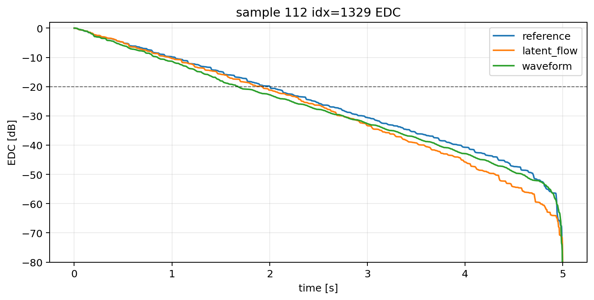
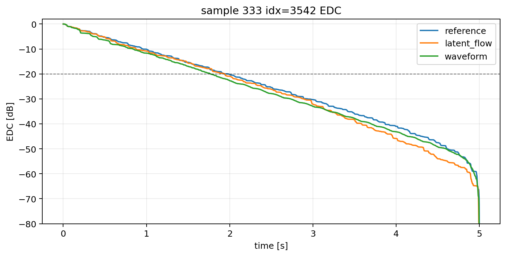
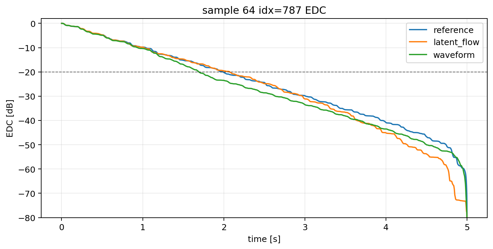
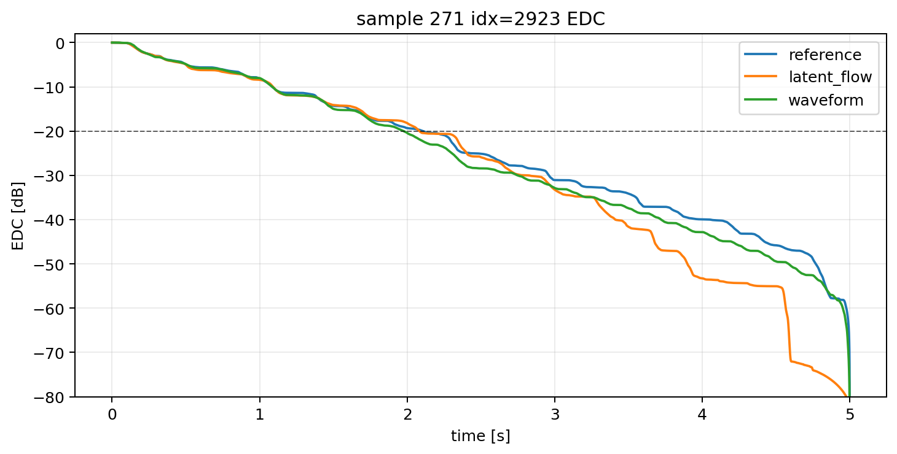
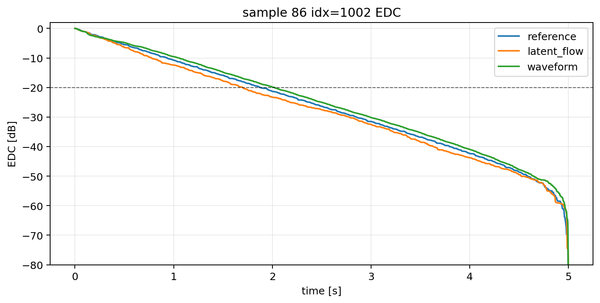
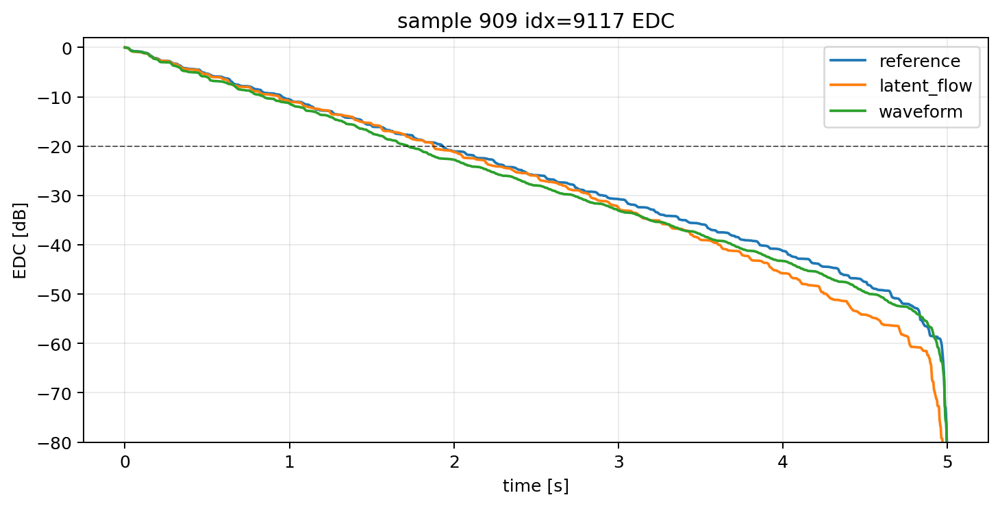

This page accompanies the paper **“Physically Conditioned Plate Impulse
Response Synthesis with Neural Codec Latent Flow Matching.”** We compare target
plate impulse responses with responses generated by the proposed codec-latent
flow-matching model (CLFM) and by its waveform-domain counterpart (W-CFM).

Use headphones and keep the playback level moderate. The files below are
peak-normalized only for listening; the quantitative results in the paper are
computed from the original-scale signals. These examples provide a qualitative
comparison and do not constitute a formal listening test.

## Example 1

<table class="demo-table">
  <thead><tr><th>Conditioning</th><th>Ground truth</th><th>CLFM</th><th>W-CFM</th></tr></thead>
  <tbody><tr>
    <td class="parameters"><i>&mu;</i> = 23.07 <i>D</i>/<i>&mu;</i> = 12.58 <i>T</i>0/<i>&mu;</i> = 1.449 <i>L</i>y = 2.331 m <i>x</i>o = 0.908 <i>y</i>o = 0.738</td>
    <td><audio controls preload="none"><source src="examples/example_01/ground_truth.wav" type="audio/wav">Audio playback is not supported.</audio></td>
    <td><audio controls preload="none"><source src="examples/example_01/clfm.wav" type="audio/wav">Audio playback is not supported.</audio></td>
    <td><audio controls preload="none"><source src="examples/example_01/w_cfm.wav" type="audio/wav">Audio playback is not supported.</audio></td>
  </tr><tr><td colspan="4"></td></tr></tbody>
</table>

## Example 2

<table class="demo-table">
  <thead><tr><th>Conditioning</th><th>Ground truth</th><th>CLFM</th><th>W-CFM</th></tr></thead>
  <tbody><tr>
    <td class="parameters"><i>&mu;</i> = 12.91 <i>D</i>/<i>&mu;</i> = 0.753 <i>T</i>0/<i>&mu;</i> = 0.00648 <i>L</i>y = 2.951 m <i>x</i>o = 0.513 <i>y</i>o = 0.998</td>
    <td><audio controls preload="none"><source src="examples/example_02/ground_truth.wav" type="audio/wav">Audio playback is not supported.</audio></td>
    <td><audio controls preload="none"><source src="examples/example_02/clfm.wav" type="audio/wav">Audio playback is not supported.</audio></td>
    <td><audio controls preload="none"><source src="examples/example_02/w_cfm.wav" type="audio/wav">Audio playback is not supported.</audio></td>
  </tr><tr><td colspan="4"></td></tr></tbody>
</table>

## Example 3

<table class="demo-table">
  <thead><tr><th>Conditioning</th><th>Ground truth</th><th>CLFM</th><th>W-CFM</th></tr></thead>
  <tbody><tr>
    <td class="parameters"><i>&mu;</i> = 3.047 <i>D</i>/<i>&mu;</i> = 4.206 <i>T</i>0/<i>&mu;</i> = 84.04 <i>L</i>y = 2.808 m <i>x</i>o = 0.520 <i>y</i>o = 0.590</td>
    <td><audio controls preload="none"><source src="examples/example_03/ground_truth.wav" type="audio/wav">Audio playback is not supported.</audio></td>
    <td><audio controls preload="none"><source src="examples/example_03/clfm.wav" type="audio/wav">Audio playback is not supported.</audio></td>
    <td><audio controls preload="none"><source src="examples/example_03/w_cfm.wav" type="audio/wav">Audio playback is not supported.</audio></td>
  </tr><tr><td colspan="4"></td></tr></tbody>
</table>

## Example 4

<table class="demo-table">
  <thead><tr><th>Conditioning</th><th>Ground truth</th><th>CLFM</th><th>W-CFM</th></tr></thead>
  <tbody><tr>
    <td class="parameters"><i>&mu;</i> = 90.21 <i>D</i>/<i>&mu;</i> = 21.06 <i>T</i>0/<i>&mu;</i> = 0.000552 <i>L</i>y = 1.262 m <i>x</i>o = 0.543 <i>y</i>o = 0.816</td>
    <td><audio controls preload="none"><source src="examples/example_04/ground_truth.wav" type="audio/wav">Audio playback is not supported.</audio></td>
    <td><audio controls preload="none"><source src="examples/example_04/clfm.wav" type="audio/wav">Audio playback is not supported.</audio></td>
    <td><audio controls preload="none"><source src="examples/example_04/w_cfm.wav" type="audio/wav">Audio playback is not supported.</audio></td>
  </tr><tr><td colspan="4"></td></tr></tbody>
</table>

## Example 5

<table class="demo-table">
  <thead><tr><th>Conditioning</th><th>Ground truth</th><th>CLFM</th><th>W-CFM</th></tr></thead>
  <tbody><tr>
    <td class="parameters"><i>&mu;</i> = 12.77 <i>D</i>/<i>&mu;</i> = 184.2 <i>T</i>0/<i>&mu;</i> = 0.000960 <i>L</i>y = 3.865 m <i>x</i>o = 0.658 <i>y</i>o = 0.941</td>
    <td><audio controls preload="none"><source src="examples/example_05/ground_truth.wav" type="audio/wav">Audio playback is not supported.</audio></td>
    <td><audio controls preload="none"><source src="examples/example_05/clfm.wav" type="audio/wav">Audio playback is not supported.</audio></td>
    <td><audio controls preload="none"><source src="examples/example_05/w_cfm.wav" type="audio/wav">Audio playback is not supported.</audio></td>
  </tr><tr><td colspan="4"></td></tr></tbody>
</table>

## Example 6

<table class="demo-table">
  <thead><tr><th>Conditioning</th><th>Ground truth</th><th>CLFM</th><th>W-CFM</th></tr></thead>
  <tbody><tr>
    <td class="parameters"><i>&mu;</i> = 46.80 <i>D</i>/<i>&mu;</i> = 3.667 <i>T</i>0/<i>&mu;</i> = 0.000970 <i>L</i>y = 3.308 m <i>x</i>o = 0.629 <i>y</i>o = 0.554</td>
    <td><audio controls preload="none"><source src="examples/example_06/ground_truth.wav" type="audio/wav">Audio playback is not supported.</audio></td>
    <td><audio controls preload="none"><source src="examples/example_06/clfm.wav" type="audio/wav">Audio playback is not supported.</audio></td>
    <td><audio controls preload="none"><source src="examples/example_06/w_cfm.wav" type="audio/wav">Audio playback is not supported.</audio></td>
  </tr><tr><td colspan="4"></td></tr></tbody>
</table>

